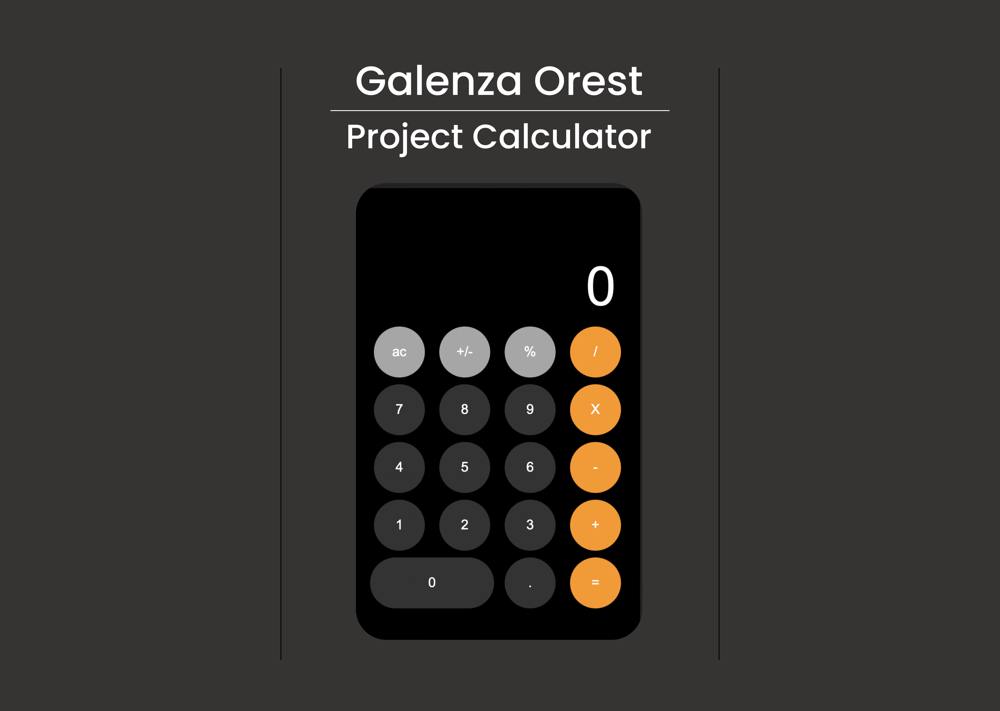

# Calculator on JavaScript

<h2><a href="https://ogshadoww.github.io/Project-calc/">View demo-version</a></h2>

----

<h2>Preview</h2>

<h2>Video preview</h2>

---

### Default actions on Calculator: +, -, *, /, =, Ac

#### Error when dividing by 0

